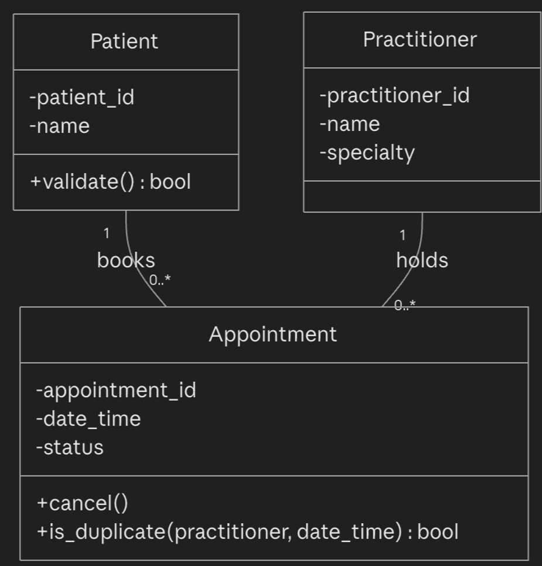

Week 6 student resource

# Requirement-to-Concept Trace

| Requirement | Concept | State/behaviour | Decision |
|---|---|---|---|
| FR-01 (create appointment, no duplicate booking) | Appointment | patient, practitioner, timeslot, status; booking responsibility | Confirmed – Appointment |
| FR-02 (search patient by name/ID) | Patient | patient ID, name | Confirmed – Patient |
| FR-03 (cancel appointment) | Appointment | status change (cancel) | Confirmed – Appointment |
| FR-04 (retain cancelled appointments in history) | Appointment | status = cancelled, not deleted | Confirmed – Appointment (no separate History class; history is the set of Appointment records) |
| FR-05 (practitioner views schedule) | Practitioner, Appointment | Practitioner collaborates with its Appointments | Confirmed – Practitioner ↔ Appointment |
| FR-06 (practitioner views patient history) | Practitioner, Patient, Appointment | Practitioner collaborates with Patient via shared Appointments | Confirmed – no direct Practitioner–Patient link needed, reached through Appointment |
| FR-07 (locate patient records) | Patient | identity/state | Confirmed – Patient |
| FR-08 (record/display appointment status) | Appointment | status attribute | Confirmed – Appointment |
| FR-09 (manage patient records) | Patient | identity/state, basic validation | Confirmed – Patient |
| FR-10 (manage practitioner records/availability) | Practitioner | identity/specialty | Confirmed – Practitioner |
| FR-11 (reliable appointment history) | Appointment | status, not deleted on cancel | Confirmed – Appointment |
| FR-12 (support operational reports) | | no state/behaviour justified yet | Deferred – reporting is a cross-object concern (service/repository), not a domain concept; no dedicated class at this stage |

# CRC Cards

## Patient

| Responsibilities | Collaborators |
|---|---|
| Know own identity (patient ID, name):  FR-02, FR-07, FR-09 | Appointment |
| Provide basic validation of own state (e.g. required ID/name present) – FR-09 | |

## Practitioner

| Responsibilities | Collaborators |
|---|---|
| Know own identity and specialty – FR-10 | Appointment |
| Know own availability/schedule (via its Appointments) – FR-05, FR-10 | |

## Appointment

| Responsibilities | Collaborators |
|---|---|
| Know its patient, practitioner, date/time and status – FR-01, FR-08 | Patient |
| Validate it is not a duplicate booking for its practitioner/timeslot: FR-01, NFR-01 | |
| Change own status (e.g. cancel) while preserving the record – FR-03, FR-04, FR-11 | Practitioner |

## Optional class

| Responsibilities | Collaborators |
|---|---|
| | |

# UML Class Diagram

Insert/draw UML here. Include defensible relationships and
multiplicities.! 

# Design Rationale

Explain class selection, responsibility allocation and key
relationships.

### Class selection

Patient, Practitioner and Appointment are the main classes because all the functional requirements (FR-01–FR-11) relate directly to one of these three. I considered having a Clinic class, but the system is only designed for one clinic location. Since there are no requirements that give the Clinic its own information or behaviour, it would not add much to the system. I would only add it later if requirements such as supporting multiple clinics were introduced.

### Responsibility allocation

Patient and Practitioner are responsible for their own personal information and basic validation, based on FR-02, FR-07, FR-09 and FR-10. Appointment is responsible for creating bookings, managing appointment status and checking for duplicate bookings. This is because FR-01, FR-03, FR-04 and FR-08 mainly describe what an appointment does. Keeping these responsibilities separate makes the system easier to understand and prevents one class from doing too many different jobs.

### Relationships

Patient–Appointment and Practitioner–Appointment are simple associations, with each Patient or Practitioner being able to have 0 or more appointments. We did not use composition because appointments need to remain in the system even after they are cancelled. FR-04 and FR-11 require cancelled appointments to stay in the appointment history. Each appointment is linked to one Patient and one Practitioner, as there are no requirements for group or multiple-patient appointments.

# AI Design Review Record

| AI suggestion | Evidence | Decision | Reason | Model change |
|---|---|---|---|---|
| Treat Patient–Appointment and Practitioner–Appointment as plain associations, not composition | FR-04/FR-11 require cancelled appointments to persist independently of ongoing patient/practitioner state | Accepted | Matches the requirement that appointment history continues beyond the action of cancellation | None – confirms the diagram above |
| Add a separate AppointmentStatus class | No FR requires status to have its own behaviour beyond being recorded and displayed (FR-08) | Modified | to keep it simple, a plain status attribute on Appointment would already satisfy FR-08 without having the complexity of a full class | Reduced AppointmentStatus from a class to an attribute on Appointment |
| Add AppointmentManager, PatientManager, ScheduleEngine, ClinicController, NotificationManager | None – no FR describes a coordinating "manager" or notification feature | Rejected | Classic AI over-design pattern (manager/controller classes with no requirement support) it conflicts with NFR-04's "simple and maintainable" goal and introduces unsupported scope (notifications aren't in the confirmed requirements) | None |
| Add a Clinic class owning Patients/Practitioners/Appointment | None – system is scoped to a single clinic location, no FR gives Clinic its own state | Rejected | No requirement support and would add an unjustified top-level container | None |