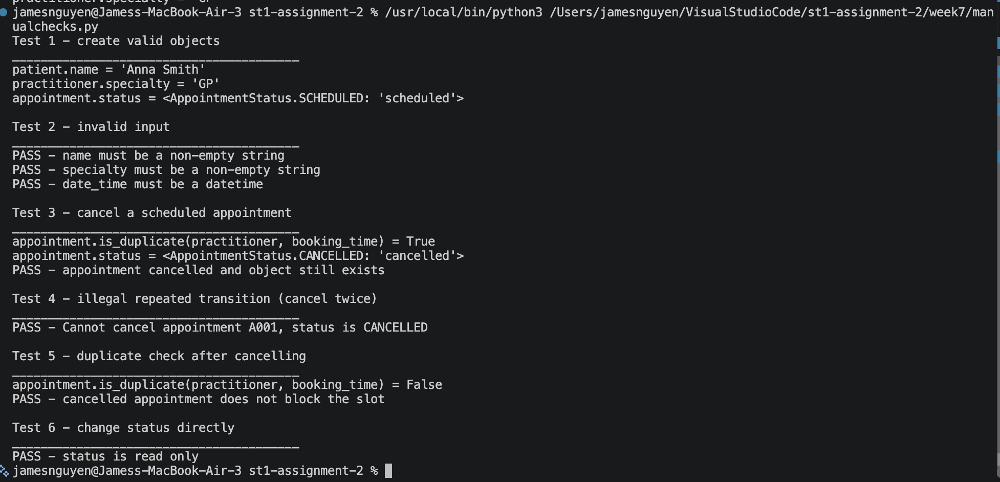

# Assignment 2 - Case Study

## Stage 4 Lab Activities

### Implementing the SmartCare Domain Layer

## A - Revisit Approved UML

Confirm responsibilities, attributes and relationships before coding.

| Class       | Attributes                                                 | Responsibilities                                                                                 | Relationships                                    |
|-------------|------------------------------------------------------------|--------------------------------------------------------------------------------------------------|--------------------------------------------------|
| Patient     | patient_id, name                                           | Validate own name via validate() : bool                                                          | Association with Appointment                     |
| Practitioner | practitioner_id, name, specialty                           | Hold identity only, no behaviour yet                                                             | Association with Appointment                     |
| Appointment | appointment_id, date_time, status (AppointmentStatus enum) | Control own status via cancel(), detect clashes via is_duplicate(practitioner, date_time) : bool | Associated with one Patient and one Practitioner |

## B - Implement Patient: AI OFF

Implement Patient with type hints and basic validation.

Done in patient.py

## C - Implement Practitioner: AI OFF

Implement Practitioner with identifier, name and specialty; no database
logic.

Done in practitioner.py

## D - Implement Appointment: AI ON

Give AI the approved Appointment UML, business rules and explicit
constraints. Ask it to implement only Appointment and agreed
enum/exception.

Done in appointment.py

## E - Review Generated Code

Check model consistency, unsupported features, public state mutation,
unnecessary inheritance, invented dependencies and error handling.

| Check                   | Result                                                                                               |
|-------------------------|------------------------------------------------------------------------------------------------------|
| Model consistency       | Attributes and methods match the approved UML. Associations used for Patient and Practitioner        |
| Unsupported features    | None kept. No file storage, lists or extra statuses (e.g. COMPLETED) that the UML doesn't include    |
| Public state mutation   | All attributes private (_status etc.) with read-only @property. Status changes only inside cancel() |
| Unnecessary inheritance | None. No class inherits from another domain class                                                    |
| Invented dependencies   | None. No database, UI, NotificationManager or service classes. Only datetime and enum imported       |
| Error handling          | ValueError / TypeError for invalid input; InvalidTransitionError for an illegal status change        |

## F - Manual Behaviour Checks

Create valid objects, test invalid input, cancel a scheduled appointment
and attempt an illegal repeated transition.

Done in manualchecks.py

## G - Refactor

Remove unnecessary code and make implementation simpler and
design-consistent.

The first AI version was a single file and more complex than needed.
Changes made:

- Split into patient.py, practitioner.py and appointment.py, one file
  per lab step, so each class is easier to find and review.

- Removed __repr__ methods. They weren't in the UML and weren't
  needed for the checks.

- Removed from __future__ import annotations. It wasn't needed and
  hasn't been covered in class.

- Replaced the loop-based validation in Practitioner with three simple
  if checks, matching the style taught in weeks 4–5.

- Split the is_duplicate() condition into three named bool variables so
  the rule is easier to read.

- Added # comments and :param: / :return: docstrings.

## H - AI Engineering Log

Record prompt, generated contribution, decisions and verification
evidence.

Prompt = the suggested AI prompt below

## Suggested AI prompt

Act as a Python pair programmer. Implement only the Appointment class
from the approved SmartCare UML. Use type hints and an AppointmentStatus
enum. Cancelled appointments remain as objects. Do not add database, UI,
notification or service classes. Protect status transitions and explain
any decision not directly visible in the UML.

Decisions: Kept private attributes with read-only properties. Kept the
status guard in cancel(). is_duplicate() only checks SCHEDULED
appointments. Had a simplified style and split into separate files

*Figure H1: manualchecks.py output, 6/6 tests pass*

## Reflection

Which AI-generated part did you modify or reject? Why? How did the
approved design constrain the AI?

**Which AI-generated part did you modify or reject? Why?**  
I simplified the generated code because it included things not in the
UML or not taught yet, like __repr__ methods, a __future__
import and loop-based validation. I also split it into one file per
class. I kept the rule that is_duplicate() only counts SCHEDULED
appointments, because otherwise a cancelled booking would wrongly block
that time slot. I rejected adding file storage because it's
database-style logic, and the domain layer shouldn't handle that.

**How did the approved design constrain the AI?**  
The UML and business rules set clear limits. Only the listed attributes
and methods were allowed, status had to use an enum, and cancelled
appointments had to be kept as objects. The prompt also banned database,
UI and notification classes. Because of this, I could check the output
against the design line by line and reject anything extra, instead of
accepting whatever the AI produced.